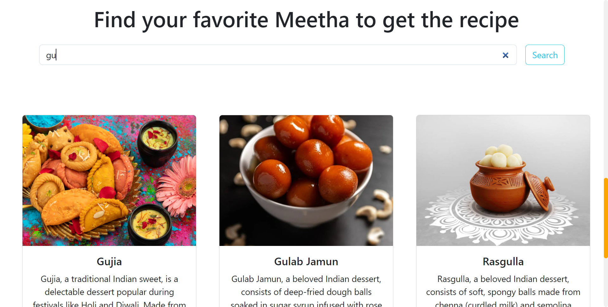

# indian-meetha
My second git repository is a creative endeavor utilizing HTML, CSS, and JS. The Bootstrap framework is also used on this website for the page's design and effects. The key feature to highlight is the search bar, which allows you to find the recipe for a specific dessert by matching the name of the sweets with any matching keyword.
  
  
  
 
  
  
  
  This demonstrates that matching keyword desserts would show.
  
  
  
 
  
  
  
